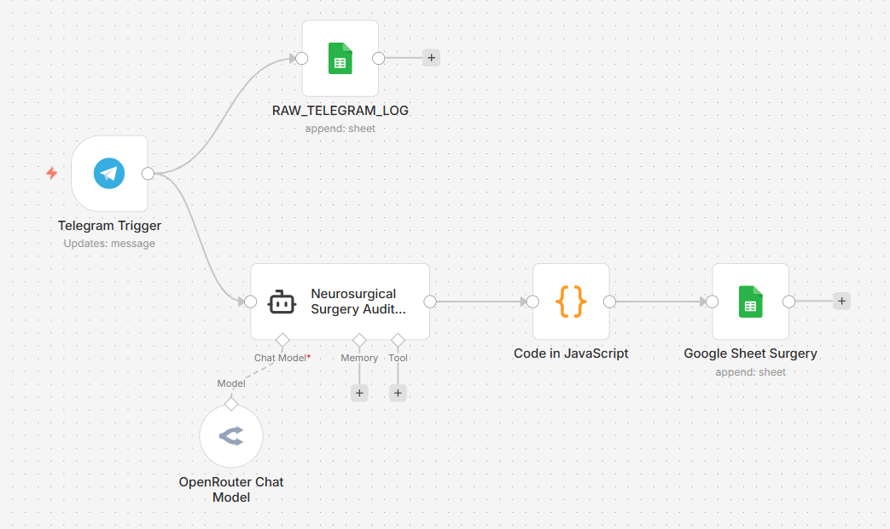
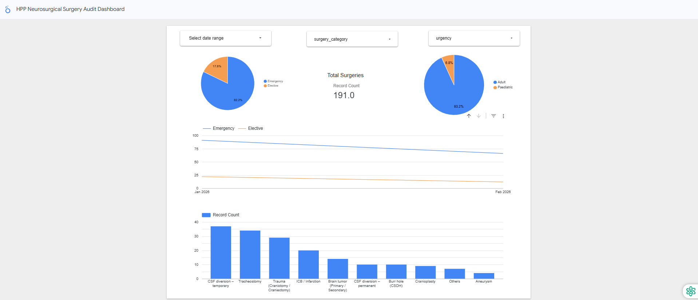

# The NeuroAudit Agent 🧠

> An AI-powered automation system for neurosurgery audit data collection and processing using n8n, built for the AI Agent Intensive Capstone Project (Kaggle Competition, November 2025).

[](https://n8n.io)
[](https://openrouter.ai)
[](https://sheets.google.com)
[](https://telegram.org)

## 📋 Table of Contents

- [Overview](#overview)
- [Problem Statement](#problem-statement)
- [Solution Architecture](#solution-architecture)
- [Key Features](#key-features)
- [Workflow Diagram](#workflow-diagram)
- [Technical Stack](#technical-stack)
- [How It Works](#how-it-works)
- [Data Processing Pipeline](#data-processing-pipeline)
- [Setup Instructions](#setup-instructions)
- [Project Structure](#project-structure)
- [Use Case & Benefits](#use-case--benefits)
- [Kaggle Competition](#kaggle-competition)
- [License](#license)

## 🎯 Overview

NeuroAudit Agent is an intelligent automation system designed to streamline neurosurgery audit data collection in healthcare settings. The system captures surgical case reports from Telegram messages, processes them using AI, and automatically populates structured databases for audit and analysis purposes.

## ❗ Problem Statement

### The Challenge in Healthcare Auditing

Medical auditing, particularly in neurosurgery departments, faces three critical challenges:

1. **⏱️ Time-Consuming**: Manual data entry for each surgical case takes significant time away from clinical duties
2. **👥 Resource-Intensive**: Requires dedicated personnel to collect, verify, and input data
3. **🚫 Human Error**: Manual transcription and categorization prone to inconsistencies and mistakes

### Real-World Impact

- Surgical teams spend hours weekly on audit paperwork
- Data inconsistencies make it difficult to track department performance
- Delayed reporting hampers real-time quality improvement initiatives

## 💡 Solution Architecture

NeuroAudit Agent automates the entire audit pipeline:

```
Telegram Message → AI Parser → Data Normalization → Google Sheets → Analytics Ready
```

### Core Components

1. **Telegram Bot Interface**: Accepts natural language surgical reports
2. **AI-Powered Extraction**: Uses Google Gemini via OpenRouter to extract structured data
3. **Smart Categorization**: JavaScript logic for normalizing and categorizing procedures
4. **Automated Storage**: Direct integration with Google Sheets for instant database updates
5. **Dual Logging**: Maintains raw logs and processed records for audit trails

## ✨ Key Features

### 🤖 Intelligent Data Extraction
- Natural language processing of surgical reports
- Automatic identification of patient demographics, diagnoses, and procedures
- Support for multiple identifier formats (IC/MRN/ICMRN)

### 📊 Smart Categorization
- 30+ predefined surgery categories covering neurosurgical procedures
- Context-aware inference when explicit categories are missing
- Automatic age group classification (Adult/Paediatric)
- Urgency detection (Emergency/Elective)

### 🔄 Robust Data Processing
- Fallback mechanisms for incomplete data
- Normalization of medical terminology variants
- Error handling with graceful degradation
- Preservation of raw messages for verification

### 📈 Real-Time Updates
- Instant database population after each report
- Telegram message ID tracking for traceability
- Timestamp logging for temporal analysis
- Multi-branch workflow for parallel processing

## 🗺️ Workflow Diagram



### Dashboard Preview



*Example analytics dashboard showing audit data visualization*

## 🛠️ Technical Stack

| Component | Technology | Purpose |
|-----------|-----------|---------|
| **Workflow Engine** | n8n (self-hosted) | Orchestrates the entire automation pipeline |
| **AI Model** | Google Gemini 2.5 Flash Lite | Extracts structured data from natural language |
| **AI Gateway** | OpenRouter | Manages AI model access and routing |
| **Messaging Platform** | Telegram Bot API | Receives surgical case reports from medical staff |
| **Data Processing** | JavaScript (n8n Code Node) | Normalizes and categorizes extracted data |
| **Database** | Google Sheets | Stores processed audit records |
| **Hosting** | Hostinger VPS | Self-hosted n8n instance |

## 🔧 How It Works

### Step-by-Step Process

#### 1️⃣ **Message Reception**
Medical staff send surgical case details via Telegram bot:
```
Dr. John: Emergency surgery today
Patient: ABC (IC: 123456)
DX: Acute SDH post-trauma
OP: Decompressive craniectomy
Age: 45 years
```

#### 2️⃣ **AI Parsing**
The AI agent processes the message using a specialized system prompt:
- Identifies key entities (patient, diagnosis, procedure)
- Categorizes surgery type
- Determines age group and urgency level
- Outputs structured JSON

#### 3️⃣ **Data Normalization**
JavaScript mapper ensures data quality:
- Standardizes age group values ("Paediatric" vs "Pediatric")
- Normalizes urgency labels ("Emergency" vs "Urgent")
- Applies intelligent category inference based on diagnosis and operation
- Handles missing or ambiguous data with smart defaults

#### 4️⃣ **Database Update**
Two parallel writes occur:
- **Raw Log**: Original Telegram message preserved
- **Structured Record**: Processed data with all fields populated

### AI System Prompt

The AI agent uses a carefully crafted prompt that:
- Defines 30+ surgery categories with specific mapping rules
- Enforces strict age group and urgency value constraints
- Provides disambiguation rules for complex cases
- Ensures consistent JSON output format

See [`prompts/ai-system-prompt-v3.txt`](prompts/ai-system-prompt-v3.txt) for full details.

### Category Inference Logic

The JavaScript mapper includes sophisticated inference rules:

```javascript
// Example: CSF diversion inference
if (operation.includes("evd") || 
    operation.includes("icp probe") || 
    operation.includes("bolt")) {
    return "CSF diversion – temporary";
}

// Example: ICB/Infarction detection
if (diagnosis.includes("ich") || 
    diagnosis.includes("intracerebral") ||
    diagnosis.includes("mca infarct")) {
    return "ICB / Infarction";
}
```

See [`code/javascript-mapper-v3.js`](code/javascript-mapper-v3.js) for complete logic.

## 📊 Data Processing Pipeline

### Input Schema (Telegram)
```
Natural language text message
├─ Reporter identification
├─ Surgery date (optional)
├─ Patient demographics
├─ Diagnosis description
└─ Operation/procedure details
```

### Output Schema (Google Sheets)
```
Structured audit record
├─ surgery_id (auto)
├─ surgery_date
├─ reported_ts
├─ reporter_name
├─ telegram_message_id
├─ patient_name (anonymized in production)
├─ patient_ic_mrn (anonymized in production)
├─ age_group: "Adult" | "Paediatric"
├─ urgency: "Emergency" | "Elective"
├─ surgery_category: [30+ predefined categories]
├─ diagnosis
└─ operation
```

### Surgery Categories

<details>
<summary>Click to view all 30+ supported categories</summary>

**Cranial Procedures:**
- Trauma (Craniotomy / Craniectomy)
- ICB / Infarction
- Brain tumor (Primary / Secondary)
- Infection (cranio)
- Endoscopic transsphenoidal surgery
- Aneurysm
- AVM / Bypass
- Functional neurosurgery
- Epilepsy surgery
- Cranio-endoscopic
- Cranioplasty
- Burr hole (CSDH)

**Spine Procedures:**
- Spine trauma
- Spine tumor
- Spine degenerative
- Spine dysraphism
- Spine – Other

**CSF Management:**
- CSF diversion – temporary (EVD, ICP monitoring)
- CSF diversion – permanent (VP shunt, LP shunt)

**Other Procedures:**
- Tracheostomy
- Wound debridement
- Others (scalp lesions, minor procedures)

</details>

## 🚀 Setup Instructions

### Prerequisites

- n8n instance (self-hosted or cloud)
- Telegram Bot API token
- OpenRouter API key
- Google Sheets API access
- Google OAuth2 credentials

### Configuration Steps

1. **Import Workflow**
   ```bash
   # Import the clean workflow file into your n8n instance
   workflows/NeuroAudit-Agent-v3-clean.json
   ```

2. **Configure Credentials**
   - **Telegram**: Add bot token in n8n credentials
   - **OpenRouter**: Add API key for AI model access
   - **Google Sheets**: Configure OAuth2 authentication

3. **Update Sheet Configuration**
   - Replace `YOUR_GOOGLE_SHEET_ID` with your spreadsheet ID
   - Update sheet names: `raw_telegram_log` and `master_surgery_sheet`
   - Ensure column headers match the output schema

4. **Customize Categories** (Optional)
   - Edit the JavaScript mapper to add department-specific categories
   - Modify inference rules for local terminology
   - Adjust normalization logic as needed

5. **Activate Workflow**
   - Test with sample messages
   - Monitor execution logs
   - Verify data appears correctly in Google Sheets

### Google Sheets Setup

Create a spreadsheet with two sheets:

**Sheet 1: raw_telegram_log**
| Timestamp | Sender_Name | Chat_ID | Raw_Message_Text |
|-----------|-------------|---------|------------------|

**Sheet 2: master_surgery_sheet**
| surgery_id | surgery_date | reported_ts | reporter_name | telegram_message_id | patient_name | patient_ic_mrn | age_group | urgency | surgery_category | diagnosis | operation |
|------------|--------------|-------------|---------------|---------------------|--------------|----------------|-----------|---------|------------------|-----------|-----------|

## 📁 Project Structure

```
NeuroAudit-Agent/
├── README.md                          # This file
├── workflows/
│   └── NeuroAudit-Agent-v3-clean.json # Clean n8n workflow (no credentials)
├── prompts/
│   └── ai-system-prompt-v3.txt        # AI agent system prompt
├── code/
│   └── javascript-mapper-v3.js        # Data normalization logic
├── assets/
│   ├── neuroaudit-agent-workflow.png  # Workflow diagram
│   └── dashboard.png                  # Dashboard screenshot
└── docs/
    └── SETUP_GUIDE.md                 # Detailed setup instructions
```

## 🎯 Use Case & Benefits

### Target Users

- **Neurosurgery Departments**: Track surgical cases and outcomes
- **Quality Assurance Teams**: Monitor procedural compliance
- **Healthcare Administrators**: Generate performance reports
- **Medical Researchers**: Collect structured clinical data

### Key Benefits

| Benefit | Impact |
|---------|--------|
| ⏱️ **Time Savings** | Reduces data entry from minutes to seconds per case |
| 🎯 **Accuracy** | Eliminates transcription errors and ensures consistent categorization |
| 📊 **Real-Time Insights** | Enables immediate access to audit data for decision-making |
| 🔄 **Scalability** | Handles increasing case volumes without additional staff |
| 🔒 **Audit Trail** | Maintains complete record of raw inputs and processed outputs |
| 💰 **Cost-Effective** | Minimal infrastructure costs using open-source tools |

### Workflow Efficiency

**Before NeuroAudit Agent:**
```
Surgical case → Handwritten notes → Manual entry → Data verification → Database → Report
(Time: 5-10 minutes per case)
```

**After NeuroAudit Agent:**
```
Surgical case → Telegram message → Automated processing → Database → Report
(Time: <30 seconds per case)
```

## 🏆 Kaggle Competition

This project was developed for the **AI Agent Intensive Capstone Project** competition on Kaggle (November 2025).

### Competition Details

- **Event**: AI Agent Intensive Course - Capstone Project
- **Date**: November 2025
- **Project Link**: [Kaggle Competition Writeup](https://www.kaggle.com/competitions/agents-intensive-capstone-project/writeups/new-writeup-1763848050135#3344749)

### Project Objectives

The capstone project focused on building practical AI agent applications that solve real-world problems. NeuroAudit Agent was designed to address:

1. Reducing repetitive manual work in healthcare
2. Minimizing human error in critical data collection
3. Improving efficiency of audit processes
4. Demonstrating practical AI agent deployment

## 📝 Version History

- **v3** (March 2026): Added enhanced surgery categorization with 30+ categories and intelligent inference
- **v2** (February 2026): Improved data normalization and error handling
- **v1** (December 2025): Initial prototype with basic extraction and storage

## 🤝 Contributing

This is a portfolio project, but feedback and suggestions are welcome! Feel free to:

- Open issues for bug reports or feature suggestions
- Fork the repository to adapt for your own use case
- Share your implementation experiences

## ⚠️ Important Notes

### Data Privacy

This public repository contains:
- ✅ Sanitized workflow files (no credentials)
- ✅ Generic setup instructions
- ✅ Sample schemas and documentation

This repository does NOT contain:
- ❌ Actual patient data
- ❌ API keys or credentials
- ❌ Hospital-specific information
- ❌ Production database identifiers

### Healthcare Compliance

Before deploying in a production healthcare environment:

1. **Review data privacy regulations** (HIPAA, GDPR, local laws)
2. **Implement proper access controls** and authentication
3. **Anonymize or pseudonymize** patient identifiers
4. **Conduct security audits** of all components
5. **Obtain necessary approvals** from IT/compliance teams

This system is designed as a proof-of-concept and should be adapted to meet specific organizational and regulatory requirements.

## 📧 Contact

**Developer**: Kevin Tan  
**LinkedIn**: [tkevyn11](https://linkedin.com/in/tkevyn11)  
**GitHub**: [tkevyn11](https://github.com/tkevyn11)

---

## 📄 License

This project is shared for educational and portfolio purposes. Feel free to use and adapt the concepts for your own projects.

---

**Built with ❤️ for healthcare innovation**

*Making healthcare data collection more efficient, one automation at a time.*
